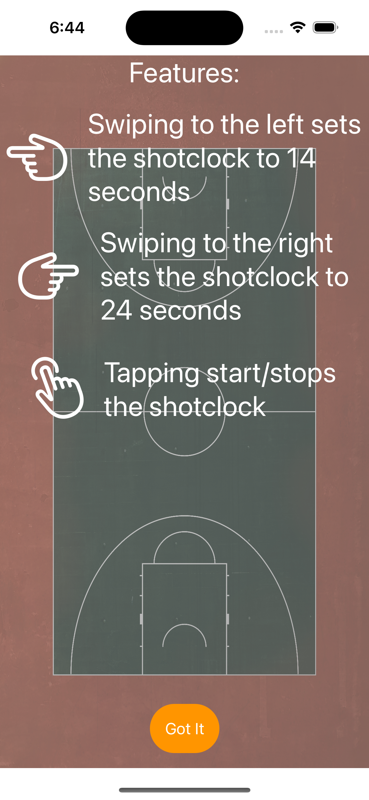
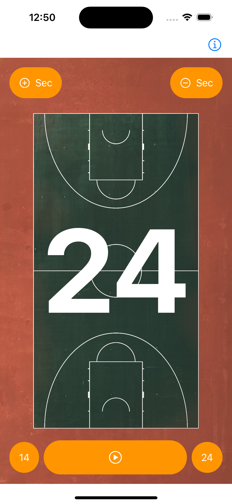
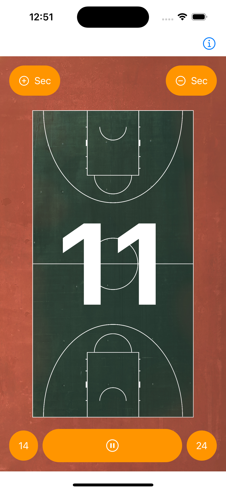

#  Shot Clock App

Simple iOS app for tracking the 24 seconds at a basketball game.
In a nutshell it is a stopwatch to keep track of the 24 seconds a basketball team has to shoot at the basket.
This is more a learning app to get into the iOS development.

The background image is a Photo by [Sayan Ghosh](https://unsplash.com/@7th_verse) on [Unsplash](https://unsplash.com/s/photos/Basketball-court?utm_source=unsplash&utm_medium=referral&utm_content=creditCopyText)

||||
|---|---|---|
||| |

## Useful Links

* [Icon Kitchen](https://icon.kitchen)
* [Unsplash](https://unsplash.com)

## Special Thanks

Special thanks to the creators/contributors to the [automatic-app-landing-page](https://github.com/emilbaehr/automatic-app-landing-page) repository.
